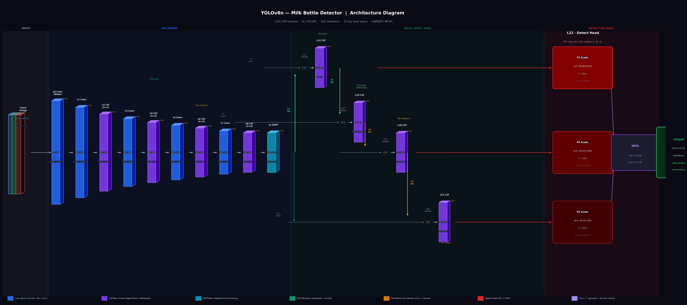
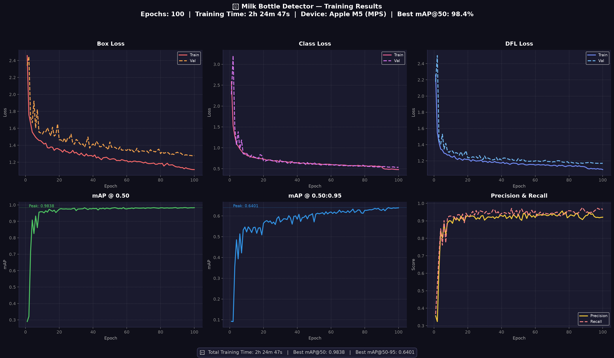
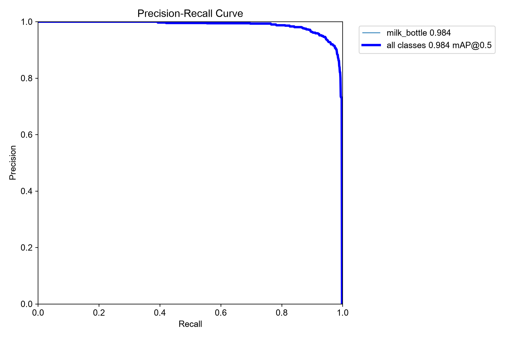
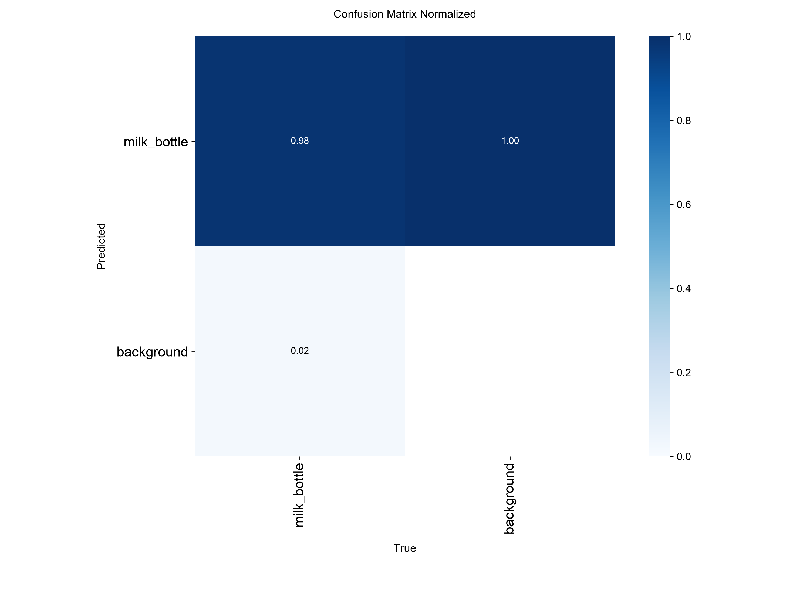

<div align="center">

# 🥛 Muralya Milk Bottle Detection

**Real-time milk bottle detection on a dairy plant conveyor belt using YOLOv8**

[](https://python.org)
[](https://ultralytics.com)
[](https://onnx.ai)
[](https://github.com/Soorya-Narayan/Muralya_Milk_Bottle_Detection)
[](https://apple.com)

</div>

---

## 📋 Overview

This project trains and deploys a **YOLOv8n object detection model** to detect milk bottles on a dairy plant conveyor belt in real time. The dataset was captured on-site at **Muralya Dairy**, annotated using **Label Studio**, and trained on an **Apple M5 MacBook Pro** using Metal Performance Shaders (MPS).

### Key Results

| Metric | Score |
|---|---|
| **mAP @ 0.50** | **98.4%** |
| **mAP @ 0.50:0.95** | **64.1%** |
| **Precision** | **93.9%** |
| **Recall** | **97.0%** |
| **Inference Speed** | **35.9 ms / image** |
| **Training Time** | ~2h 25m (100 epochs) |

---

## 🏗️ Architecture

The model uses **YOLOv8n** (nano variant) — 3 million parameters, 8.1 GFLOPs, with **SiLU activation** throughout.



| Component | Layers | Purpose |
|---|---|---|
| **Backbone** | L0–L9 (Conv + C2f + SPPF) | Multi-scale feature extraction |
| **Neck (FPN+PAN)** | L10–L21 | Cross-scale feature fusion |
| **Detect Head** | L22 | 8,400 anchor predictions via DFL |

---

## 📊 Training Results



| Curve | Preview |
|---|---|
| Precision-Recall |  |
| Confusion Matrix |  |

---

## 📁 Repository Structure

```
Muralya_Milk_Bottle_Detection/
│
├── prepare_dataset.py          # Merge 5 annotation batches → train/val/test split
├── train.py                    # YOLOv8n training script (MPS / GPU / CPU)
├── detect_live.py              # Live camera detection with count overlay + graph
├── export_model.py             # Export best.pt → ONNX
│
├── exported_model/
│   ├── milk_bottle_detector.onnx   # Trained model (ONNX, 11.8 MB)
│   └── README.md                   # ONNX usage instructions
│
├── runs/detect/milk_bottle/
│   ├── weights/best.pt             # Best PyTorch weights (6 MB)
│   ├── training_graphs.png         # Loss + mAP curves
│   ├── results.csv                 # Per-epoch metrics
│   ├── confusion_matrix*.png       # Confusion matrices
│   ├── BoxPR_curve.png             # Precision-Recall curve
│   └── ...                         # Other YOLOv8 plots
│
└── yolov8n_architecture.png        # Model architecture diagram
```

> **Note:** Raw images (`Milk_Bottles/`, `Annotated/`) and the generated `dataset/` folder are excluded from the repo (~10 GB total). Run `prepare_dataset.py` after placing your annotated data to regenerate the dataset.

---

## 🚀 Quick Start

### 1. Set Up Environment

```bash
# Using conda (recommended)
conda create -n milk-env python=3.11
conda activate milk-env
pip install ultralytics opencv-python matplotlib pandas
```

### 2. Prepare Dataset

Place your Label Studio YOLO exports in the `Annotated/` folder as:
```
Annotated/
├── annotated1/  ← each with images/ and labels/ subdirs
├── annotated2/
├── annotated3/
├── annotated4/
└── annotated5/
```

Then run:
```bash
python prepare_dataset.py
```
This creates `dataset/` with an 80/10/10 train/val/test split and `dataset/dataset.yaml`.

### 3. Train

```bash
python train.py
```
- Uses **MPS** (Apple Silicon) by default — change `DEVICE = "cpu"` or `"cuda"` in `train.py` as needed
- Trains for 100 epochs with early stopping (patience=20)
- Saves best weights to `runs/detect/milk_bottle/weights/best.pt`
- Auto-generates training graphs on completion

### 4. Run Live Detection

```bash
python detect_live.py
```

| Key | Action |
|---|---|
| `q` | Quit |
| `s` | Save screenshot |
| `p` | Pause / Resume |
| `+` / `-` | Adjust confidence threshold |

### 5. Export to ONNX

```bash
python export_model.py
```
Exports to `exported_model/milk_bottle_detector.onnx` with usage examples.

---

## 🔌 Using the ONNX Model

```python
import onnxruntime as rt
import numpy as np
import cv2

session = rt.InferenceSession("exported_model/milk_bottle_detector.onnx")
input_name = session.get_inputs()[0].name

img = cv2.imread("frame.jpg")
img = cv2.resize(img, (640, 640))
img = cv2.cvtColor(img, cv2.COLOR_BGR2RGB).astype(np.float32) / 255.0
img = img.transpose(2, 0, 1)[np.newaxis]   # BCHW

outputs = session.run(None, {input_name: img})
```

---

## 📦 Dataset

| Property | Value |
|---|---|
| Total images | 1,073 |
| Train / Val / Test | 858 / 107 / 108 |
| Classes | `milk_bottle` (1 class) |
| Annotation tool | [Label Studio](https://labelstud.io) |
| Format | YOLO (normalised cx cy w h) |
| Captured at | Muralya Dairy, conveyor belt |

---

## 🛠️ Technical Details

| Property | Value |
|---|---|
| Framework | [Ultralytics YOLOv8](https://github.com/ultralytics/ultralytics) |
| Model | YOLOv8n (nano) |
| Parameters | 3,011,043 (~3M) |
| GFLOPs | 8.1 |
| Activation | SiLU (x × σ(x)) throughout |
| Input size | 640 × 640 |
| Anchors | 8,400 (80×80 + 40×40 + 20×20) |
| Loss | DFL + CIoU + BCE |
| Training device | Apple M5 (MPS) |
| Batch size | 16 |
| Optimizer | SGD (lr=0.01, momentum=0.937) |

---

## 📄 License

This project is for internal use at **Muralya Dairy**. Dataset images are proprietary.

---

<div align="center">
Built with ❤️ using <a href="https://ultralytics.com">Ultralytics YOLOv8</a> · Trained on Apple M5
</div>
